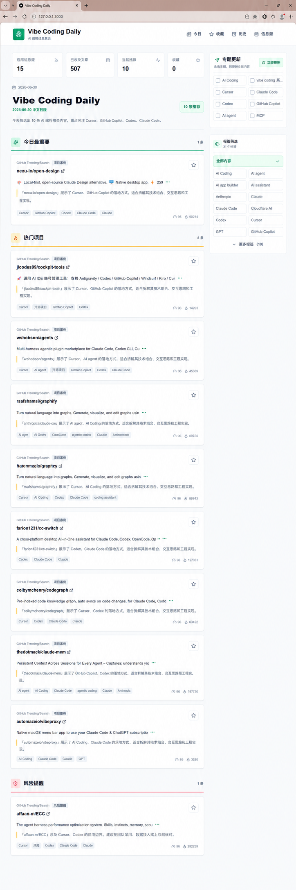
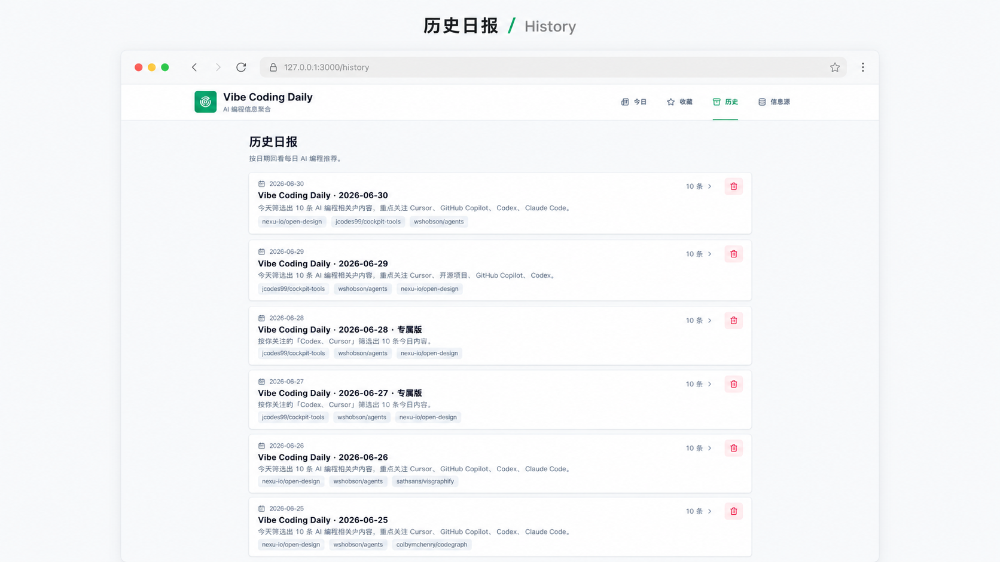
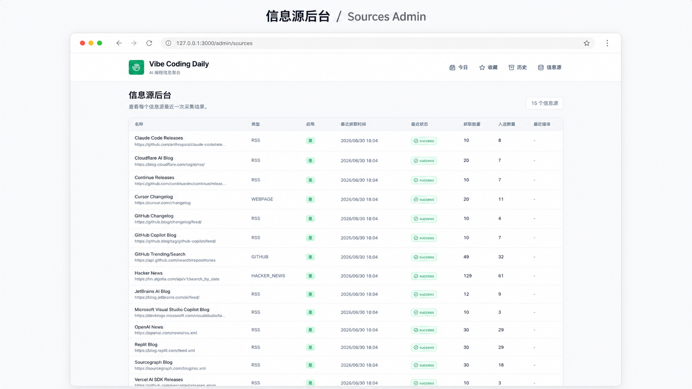
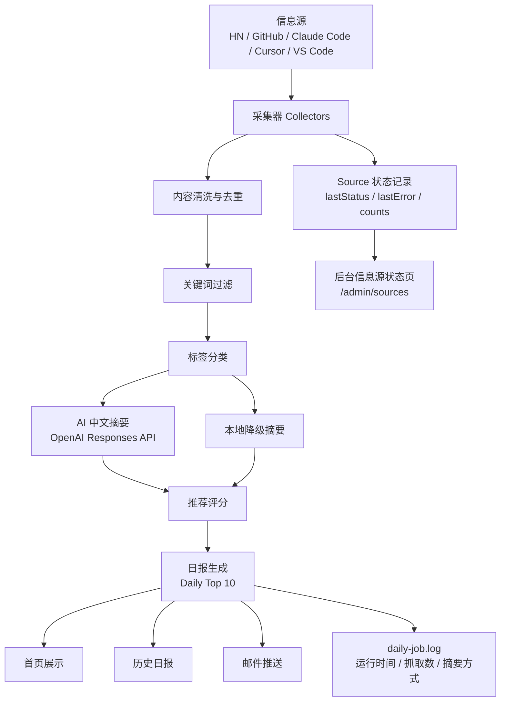

# Vibe Coding Daily

一个面向 AI 编程学习者的中文信息聚合与每日推荐系统，自动采集 Vibe Coding、AI Coding、AI Agent、Codex、Cursor、Claude Code、GitHub Copilot 等相关内容，并生成每日 Top 10 中文日报。

## 项目背景

AI 编程工具和 Agent 开发信息更新很快，内容分散在 Hacker News、GitHub、Claude Code、Cursor、VS Code、工具官网 changelog、社区文章和教程中。对于正在学习 Vibe Coding、AI 编程和产品开发的个人用户来说，每天手动筛选信息成本高，容易错过重要工具更新、项目案例和风险提醒。

Vibe Coding Daily 的目标是把“信息收集、清洗、摘要、推荐、归档”串成一个可自动运行的个人信息系统，让用户每天用较短时间掌握值得关注的内容。

## 目标用户

- 正在学习 Vibe Coding、AI 编程、AI Agent 开发的个人用户
- 关注 Codex、Cursor、Claude Code、GitHub Copilot 等工具演进的开发者
- 想用 AI 辅助产品开发、快速验证应用想法的产品/独立开发者
- 希望建立个人 AI 编程信息雷达的人

## 核心功能

- 多源信息采集：Hacker News、GitHub、Claude Code releases、Cursor changelog、VS Code updates、OpenAI News 等公开来源
- 内容清洗与去重：基于链接和内容哈希去重，过滤低质量内容
- 标签分类：自动识别 Cursor、Codex、AI Agent、开源项目、教程、风险等标签
- 推荐评分：综合相关度、新鲜度、来源可信度和热度进行排序
- AI 中文摘要：使用 OpenAI Responses API；未配置 API Key 时自动使用本地降级摘要
- 每日 Top 10 日报：按“今日最重要、工具更新、热门项目、实用教程、风险提醒、今日行动建议”组织
- 历史日报：按日期回看过往日报
- 收藏：对值得后续阅读的文章做本地收藏
- 标签筛选：按主题快速筛选日报内容
- 邮件推送：通过 Nodemailer 和 SMTP 配置发送日报
- 后台信息源状态页：查看每个 source 的最近抓取状态、错误和数量
- 手动触发接口 token 保护：`/api/jobs/daily` 需要 `Authorization: Bearer <DAILY_JOB_TOKEN>`
- 日报运行日志：写入 `logs/daily-job.log`

## 产品截图

### 今日日报

首页按“今日最重要、热门项目、工具更新和风险提醒”组织内容，并提供标签筛选与个性化更新入口。



### 历史日报

历史页按日期归档已生成的日报，支持快速回看和删除无效记录。



### 信息源状态

后台集中展示各信息源的启用状态、最近抓取结果、抓取数量、入选数量和错误信息。



## 技术栈

- Next.js
- TypeScript
- Prisma
- SQLite
- OpenAI Responses API
- Nodemailer
- node-cron / 调度脚本
- Tailwind CSS
- Lucide React

## 系统架构



## 本地启动

```bash
npm install
npm run db:setup
npm run dev -- --port 3000
```

访问：

```txt
http://localhost:3000
```

后台信息源状态页：

```txt
http://localhost:3000/admin/sources
```

## 环境变量

复制 `.env.example` 并配置 `.env`：

```txt
DATABASE_URL="file:./dev.db"

OPENAI_API_KEY=""
OPENAI_MODEL="gpt-5.4-mini"

GITHUB_TOKEN=""

SMTP_HOST=""
SMTP_PORT="587"
SMTP_USER=""
SMTP_PASS=""
EMAIL_FROM=""
EMAIL_TO=""

DAILY_JOB_TOKEN="dev-daily-token"
```

说明：

- `OPENAI_API_KEY`：可选。未配置时使用本地降级摘要。
- `GITHUB_TOKEN`：可选。配置后提升 GitHub API 限额。
- `SMTP_*` / `EMAIL_*`：可选。配置后发送日报邮件。
- `DAILY_JOB_TOKEN`：必填，用于保护手动触发接口。

## 手动触发日报

接口方式：

```bash
curl -H "Authorization: Bearer dev-daily-token" http://localhost:3000/api/jobs/daily
```

脚本方式：

```bash
npm run daily
```

首页也提供“立即更新”按钮，点击后输入 `DAILY_JOB_TOKEN` 即可触发。

## 定时任务

```bash
npm run scheduler
```

默认按 `Asia/Hong_Kong` 时区每天 08:00 运行。

## 验收结果

当前版本已完成以下验证：

- `npm run lint`
- `npx tsc --noEmit`
- `npm run build`
- `npm run daily`
- `/api/jobs/daily` 无 token 返回 `401`
- `/api/jobs/daily` 携带正确 token 返回 `200`
- `/admin/sources` 可访问并展示 source 状态
- `logs/daily-job.log` 可记录日报任务运行结果

更多验收细节见 [docs/ACCEPTANCE.md](docs/ACCEPTANCE.md)。

## 已知问题

- 部分官网页面会限制 Node 环境直接抓取，因此默认源优先选择公开 RSS、Atom feed 或稳定 API。
- 未配置 `OPENAI_API_KEY` 时会使用本地降级摘要，摘要质量低于 AI 摘要，但不影响日报生成。

## 后续规划

- 接入 Supabase / Postgres 云数据库
- 增加用户兴趣配置和关键词自定义
- 扩展更多信息源，如 Reddit、官方博客、YouTube、技术 Newsletter
- 增加趋势分析，识别一段时间内持续升温的话题
- 增加周报和月度回顾
- 部署上线，支持稳定定时任务和邮件推送
- 增加后台鉴权和 source 管理能力

## 文档

- [架构文档](docs/ARCHITECTURE.md)
- [验收文档](docs/ACCEPTANCE.md)
- [作品集说明](docs/PORTFOLIO.md)
- [面试讲解稿](docs/INTERVIEW.md)
